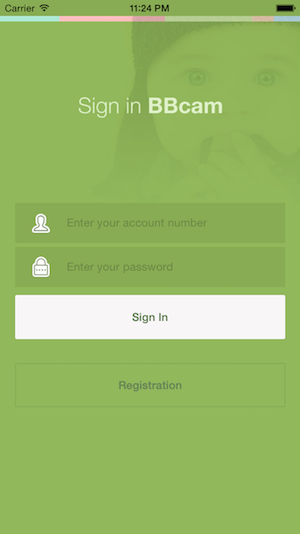
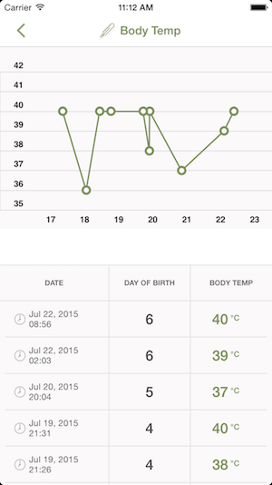
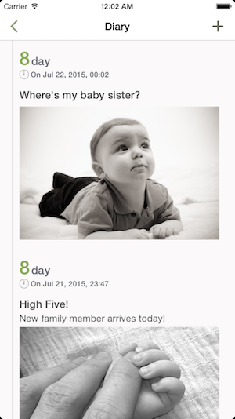
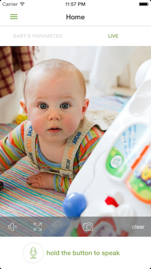

# BabyCare (Initial Product Prototype)

BabyCare is a mobile app designed to supplement the [BabyCare Product Line](www.qbb.net), which packages an IP camera, a wristband (for collecting body temperature & heart rate), and a weight scale.

This repository hosts the implementation of the initial product prototype, which is now obsolete.   
The official version has undergone numerous iterations of UI & functional re-design, visit the [App Store](https://itunes.apple.com/app/qu-bao-bao-tie-xin-shou-hu/id968231213?mt=8) for the current version.
 
Proprietary logic (web service, live streaming solution, peer-to-peer communication, etc) has been removed from this version & relevant implementations are replaced with data generation coordinated with local persistent store in light of open-sourcing.  
  
  
  
## Screenshots

####Login / Cabinet
   

####Home / Report
   

####Diary / Diary Editor
   
 
####Live View
  
  
## Authors
#####Hsuan-Chih Chuang
